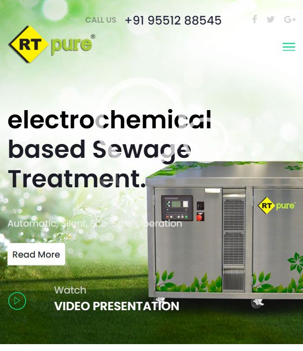

# RT Pure Website

A static website for RT Pure, showcasing electrochemical sewage treatment systems, product models, process information, brochures, and contact details.

## Live Website

Visit the published website:

```text
https://codestobecreated.github.io/rt-pure-website/
```

## Website Preview



## Video

- [RT Pure Intro Video](images/videos/RT%20Pure%20Intro.mp4)
- [RT Pure C Intro Video](images/videos/RT%20Pure%20C%20Intro.mp4)

## Pages

- Home page: `index.html`
- About: `about-us.html`
- Products and process pages for sewage treatment systems
- Brochure download resources
- Contact page

## Tech Stack

- HTML
- CSS
- JavaScript
- Static media assets

## Run Locally

Use any static server from the project folder. For example:

```bash
python -m http.server 8000
```

Then open:

```text
http://127.0.0.1:8000/
```
